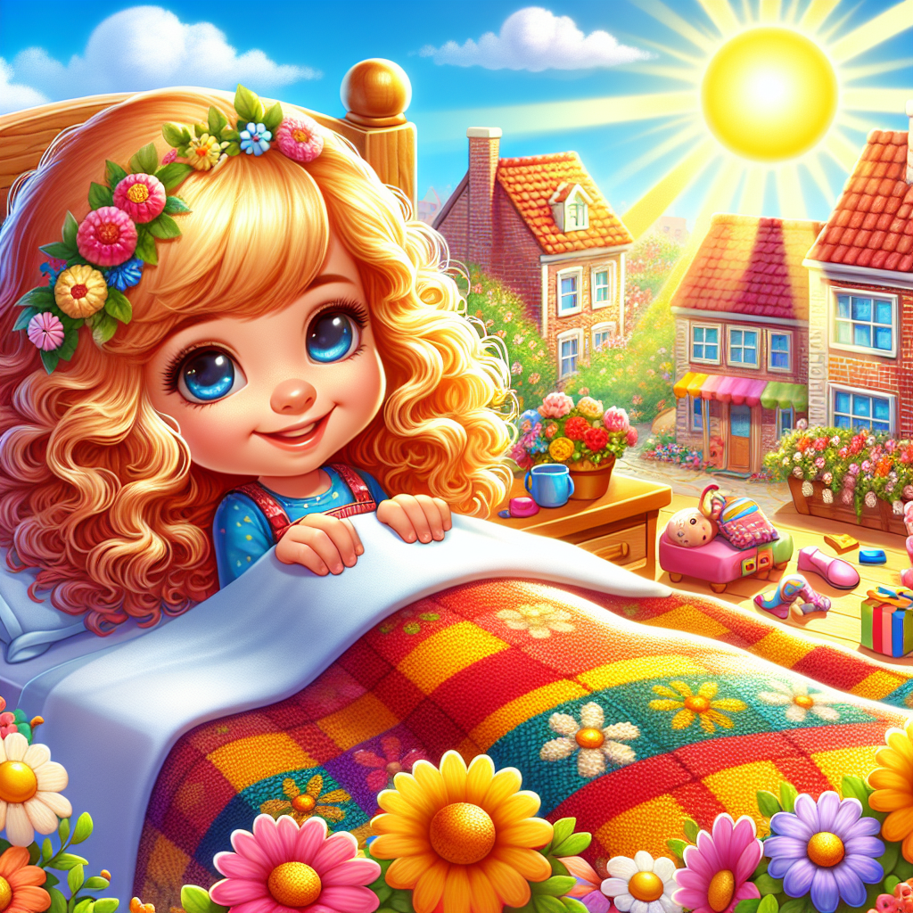
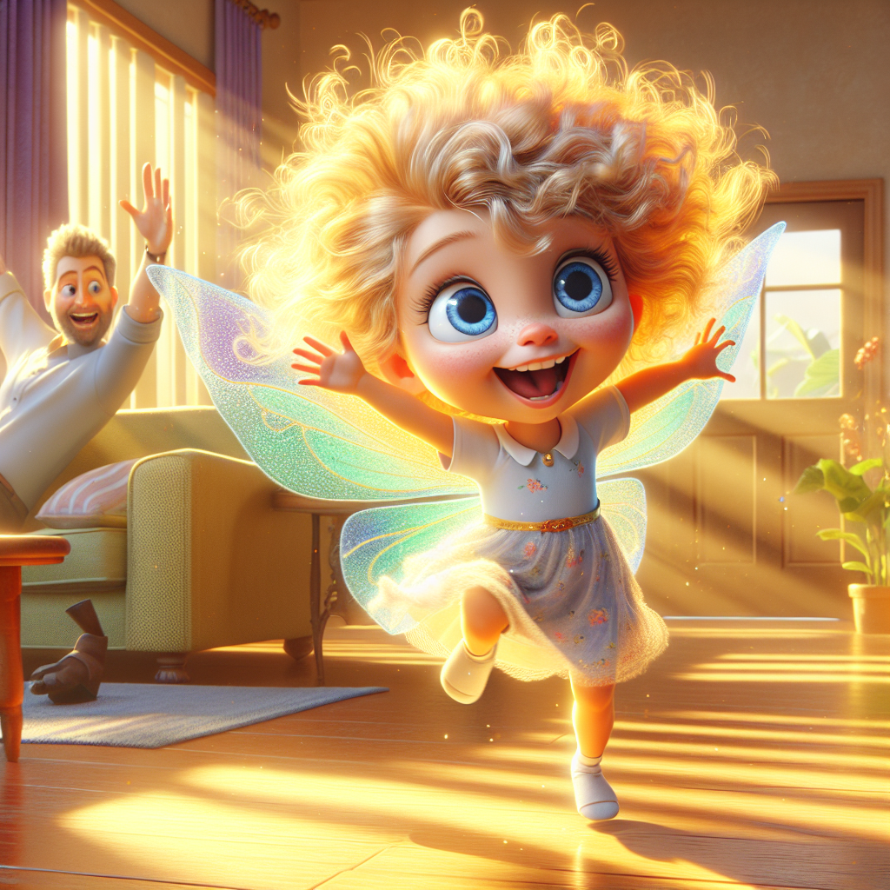
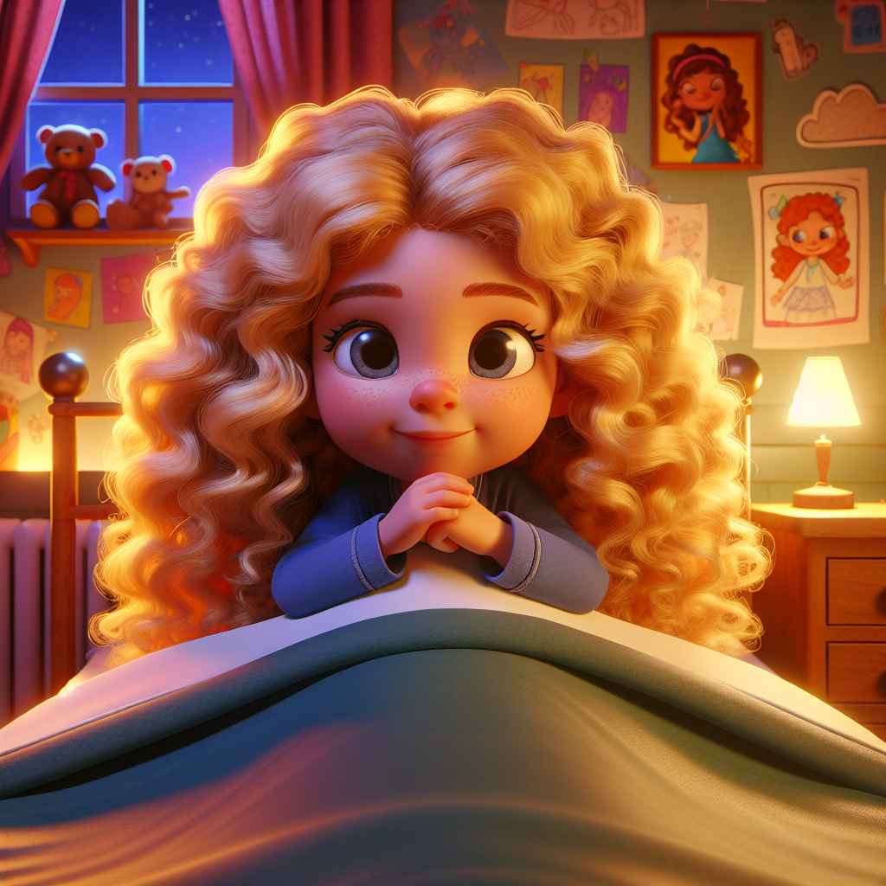
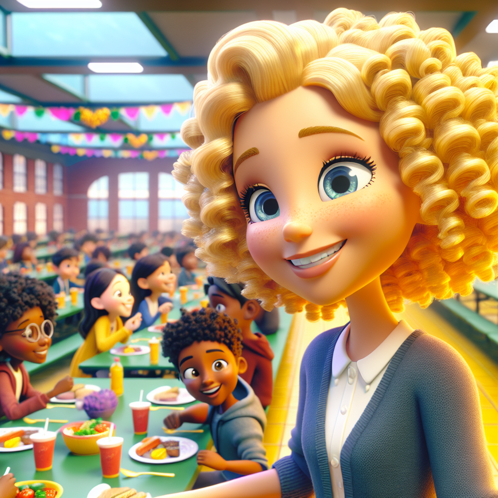
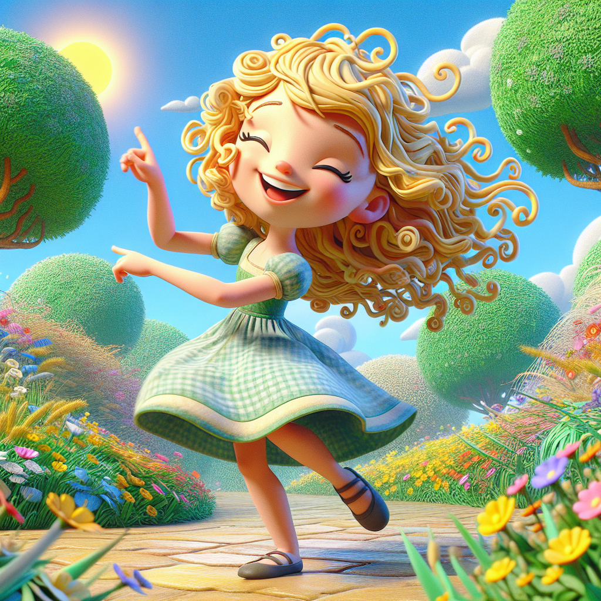

# Stallabella's Transformation

Once upon a time, in a sunny little town, there lived a 7-year-old girl named Stallabella.

With her golden curly hair bouncing like spring flowers and her bright blue eyes sparkling like the sky, she was a delightful sight to behold.

Stallabella was known for her kindness and her infectious laughter, but she had a peculiar habit—she loved to stall!

Every morning, as the sun peeked through her window, Stallabella would wake up with a big yawn and a stretch.

But instead of jumping out of bed, she would roll over and pretend to be a sleepy bear.

“Just five more minutes!” she would say, snuggling deeper into her blankets.

Her parents would call from downstairs, “Stallabella, it’s time to get up!”

But she would giggle and reply, “I’m just practicing my hibernation!”

Once she finally got out of bed, the real fun began.

Getting dressed was like a fashion show!

Stallabella would twirl in front of her mirror, trying on every outfit in her closet.

“This dress is too twirly!” she would declare, spinning around.

“And this shirt is too blue!”

She would laugh and dance, making her parents tap their feet in impatience.

Breakfast was another stage for her performance.

Instead of eating her cereal, Stallabella would create a masterpiece with her milk and fruit.

“Look, Mom! I made a rainbow!” she would exclaim, as her bowl turned into a colorful mess.

Her parents would sigh, “Stallabella, please hurry! You’ll be late for school!”

But the biggest performance of all was when it was time to leave for school.

Stallabella would pretend to be a slow-moving turtle, inching her way to the door.

“I’m just taking my time to enjoy the flowers!” she would say, stopping to smell every bloom in the garden.

Her parents would shake their heads, knowing they were in for a show.

One bright Tuesday morning, Stallabella’s stalling reached a new level.

She was so busy pretending to be a butterfly, flapping her arms and dancing around the living room, that she completely lost track of time.

When her parents finally managed to get her out the door, they rushed her to school.

But when they arrived, the school bell rang, and Stallabella realized with a gasp that she had missed the big event—the annual talent show!

Her heart sank as she watched her friends perform on stage, singing and dancing.

Stallabella felt a wave of sadness wash over her.

She had practiced her own dance routine for weeks, but now she was too late to join in the fun.

As she sat on the sidelines, she realized that while stalling was fun, it had cost her something important.

That night, as she lay in bed, Stallabella thought about her day.

She loved her performances, but she didn’t want to miss out on special moments with her friends.

With a determined smile, she decided it was time for a change.

“From now on, I’ll be Swiftabella!” she declared to her stuffed animals, who nodded in agreement.

The next morning, Stallabella woke up with a new energy.

She jumped out of bed, got dressed in record time, and even finished her breakfast without turning it into a rainbow!

Her parents were amazed.

“Who is this speedy girl?” they laughed, and Stallabella beamed with pride.

At school, Swiftabella was ready for anything.

She joined her friends for lunch, played games during recess, and even had time to help a classmate with a tricky math problem.

She felt lighter and happier, knowing she was making the most of every moment.

As the weeks went by, Swiftabella found a perfect balance.

She still loved to dance and play, but now she did it on time!

She learned that life was a beautiful performance, and being swift didn’t mean she had to stop having fun.

And so, Stallabella transformed into Swiftabella, a girl who danced through life with joy, laughter, and just the right amount of speed.

And every now and then, when she felt like it, she would still take a moment to twirl and enjoy the flowers—just not too long!

The end.
