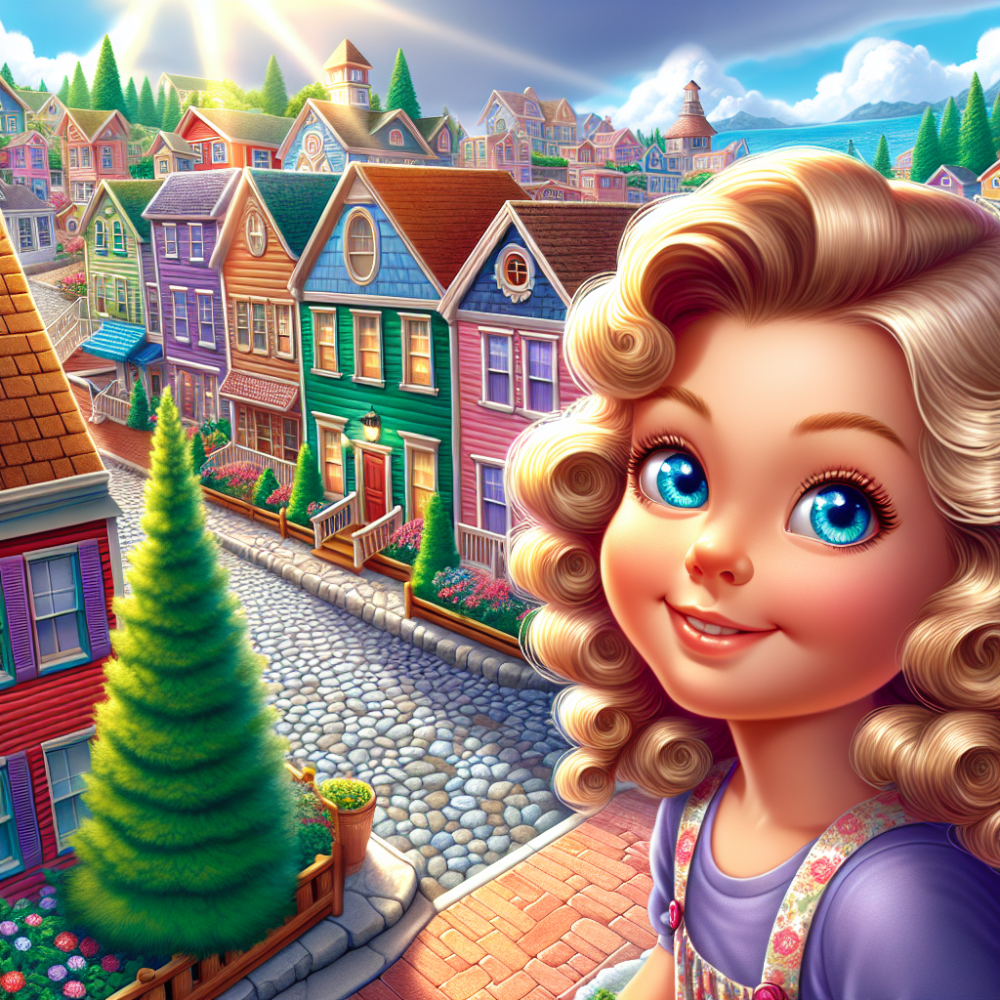
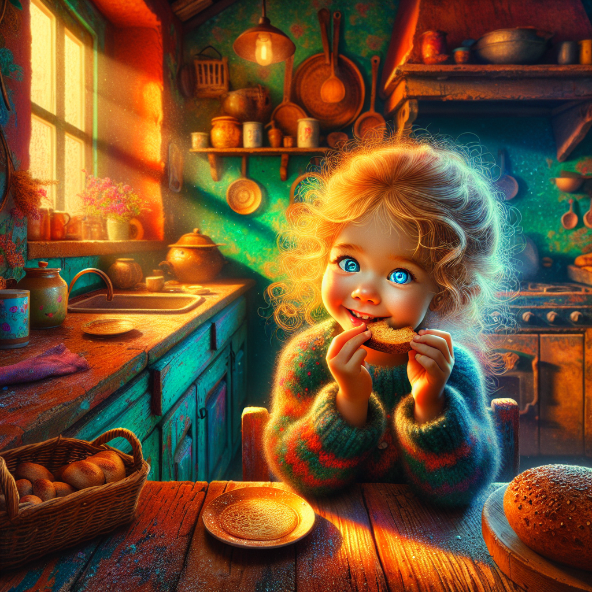
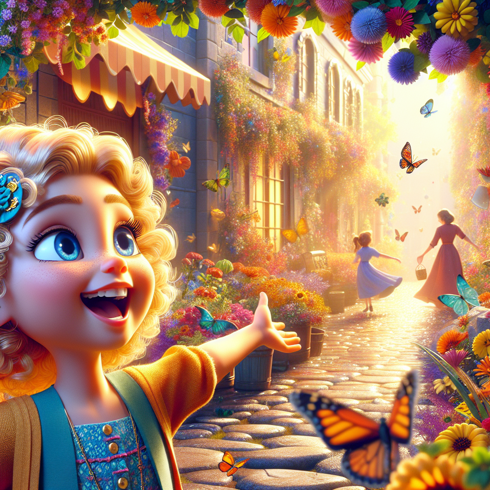
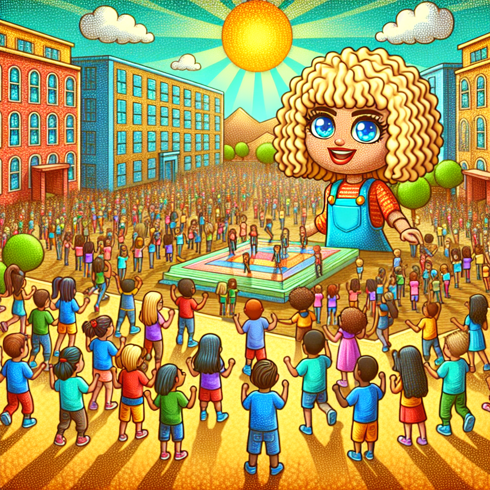
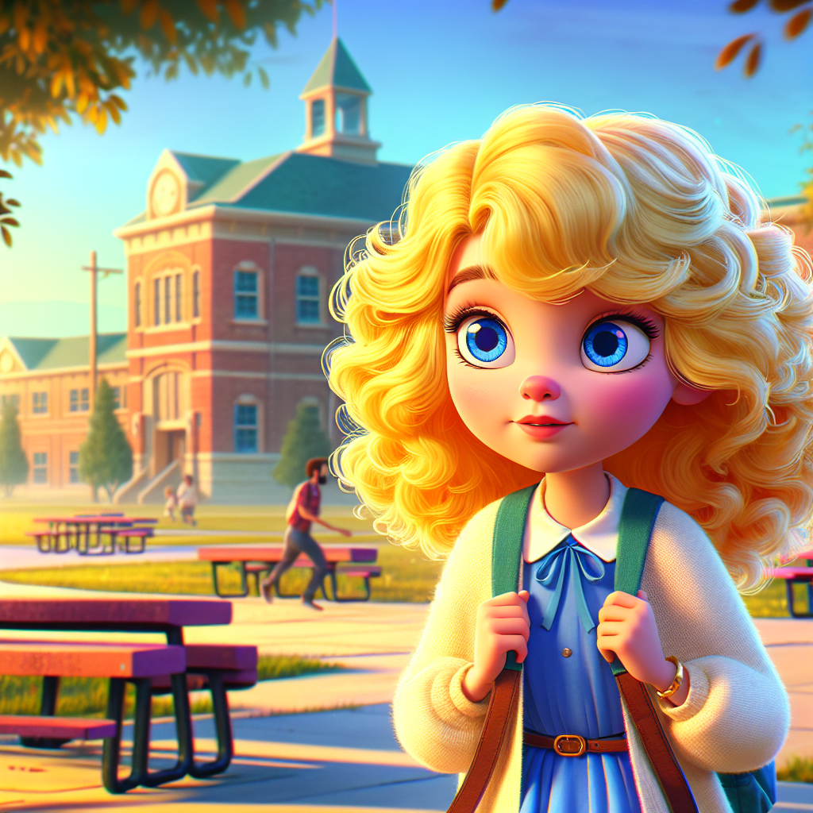
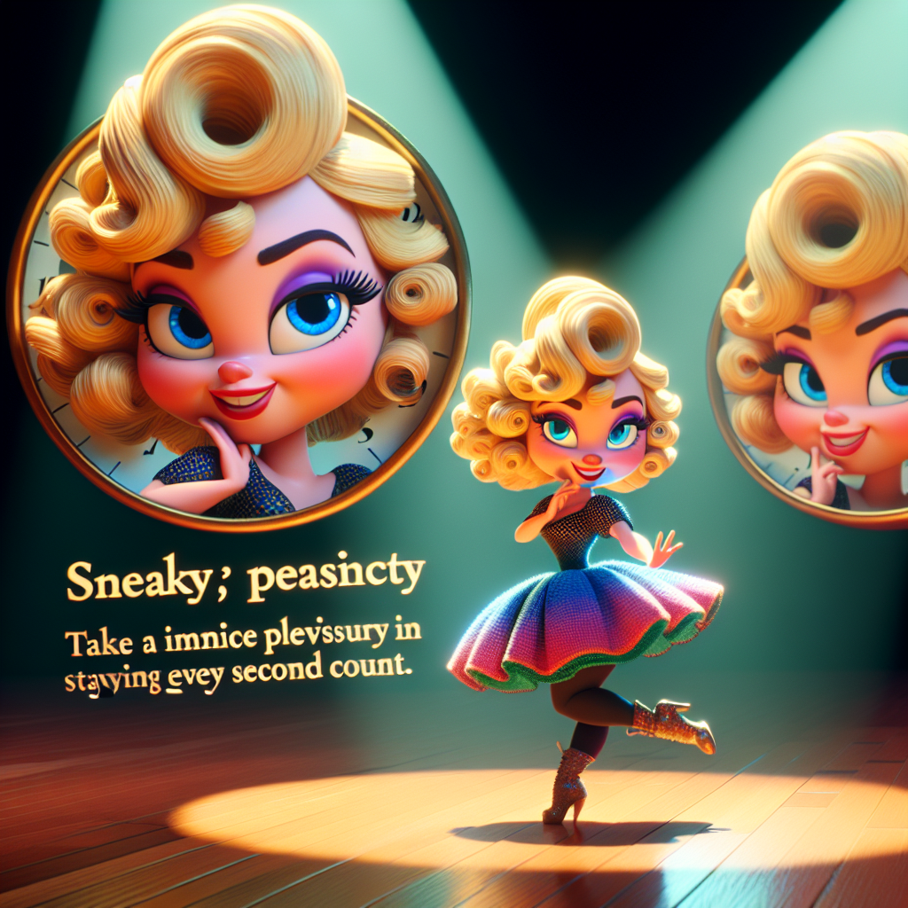
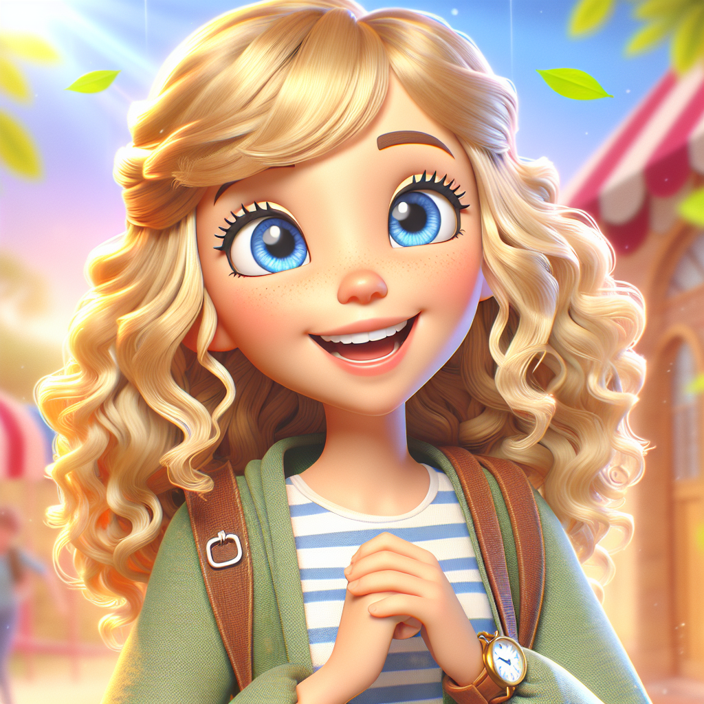
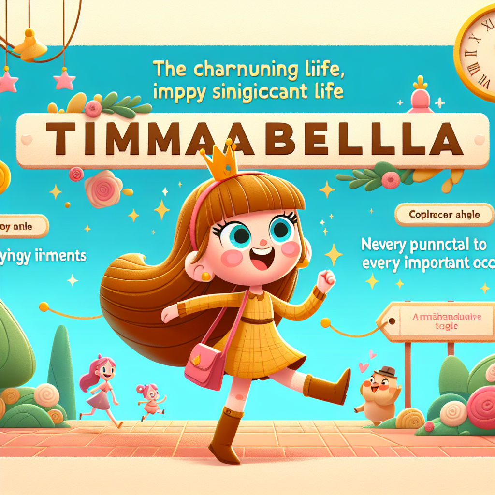

# Stallabella's Story

Once upon a time, in a cozy little town, there lived a 7-year-old girl named Stallabella. She had the most beautiful blond curly hair and sparkling blue eyes. Stallabella was known for her kind heart and her funny antics, but she had one peculiar habit—she loved to stall.

Every morning, Stallabella's room was like a stage, and she was the star performer. When her mom called her to get out of bed, Stallabella would stretch her arms wide and yawn dramatically, as if she were in a ballet. "Just five more minutes, please!" she would say, twirling under her blanket.

When it was time to get dressed, Stallabella would put on a show, trying on different outfits and striking poses in front of the mirror. "Which one should I wear today?" she would ask, even though she knew she had to wear her school uniform.

Breakfast was another act in her performance. She would take tiny bites of her toast, pretending to be a squirrel nibbling on a nut. "I'm savoring every bite," she would explain to her parents, who were always urging her to hurry up.

Stallabella's stalling didn't stop there. On the way to school, she would stop to admire every flower, every butterfly, and every interesting rock. "Look at this, Mom! Isn't it amazing?" she would exclaim, even though they were running late.

One sunny morning, Stallabella's school was hosting a special event—a visit from a famous children's author. All the students were excited to meet the author and hear her read from her new book. Stallabella's parents reminded her to hurry, but she couldn't resist her usual stalling routine.

By the time Stallabella arrived at school, the event was over. She had missed the author's visit and the chance to get her book signed. Stallabella felt a pang of regret. She realized that her stalling had caused her to miss something important.

That evening, Stallabella sat down with her parents. "I missed the author's visit because I was stalling," she admitted, her eyes filling with tears. "I don't want to miss out on important things anymore."

Her parents hugged her tightly. "We're proud of you for realizing that, sweetie," her mom said. "Stalling can be fun, but sometimes we need to be timely."

From that day on, Stallabella decided to change her ways. She still loved to perform, but she learned to balance her fun with being prompt. She even chose a new name to reflect her newfound attitude—Timabella.

Timabella still had her blond curly hair and blue eyes, and she was still kind-hearted and funny. But now, she was also timely and responsible. She found joy in being on time and discovered that she could still have fun without stalling.

And so, Timabella's days were filled with laughter, learning, and timely adventures. She never missed another important event, and she lived happily ever after, always on time.

**The End.**