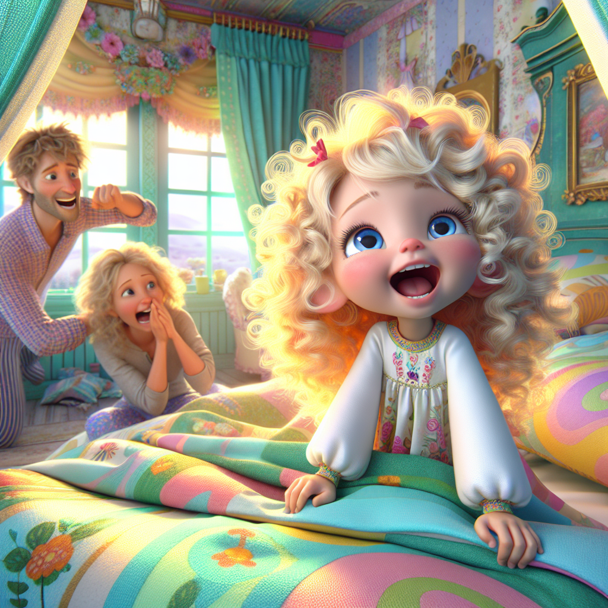
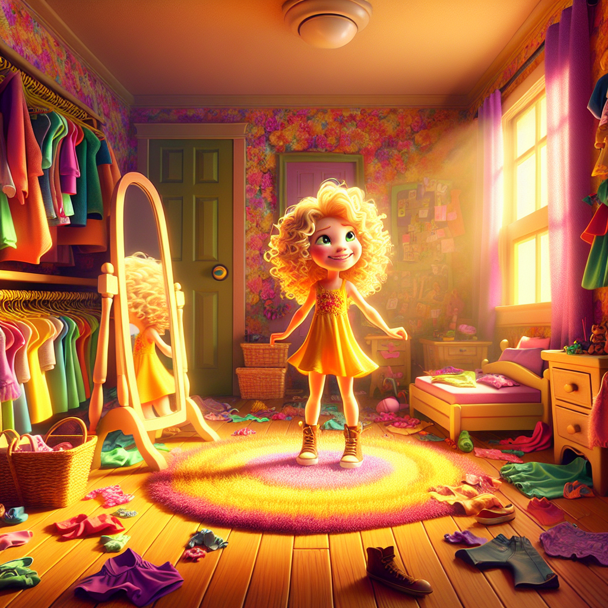
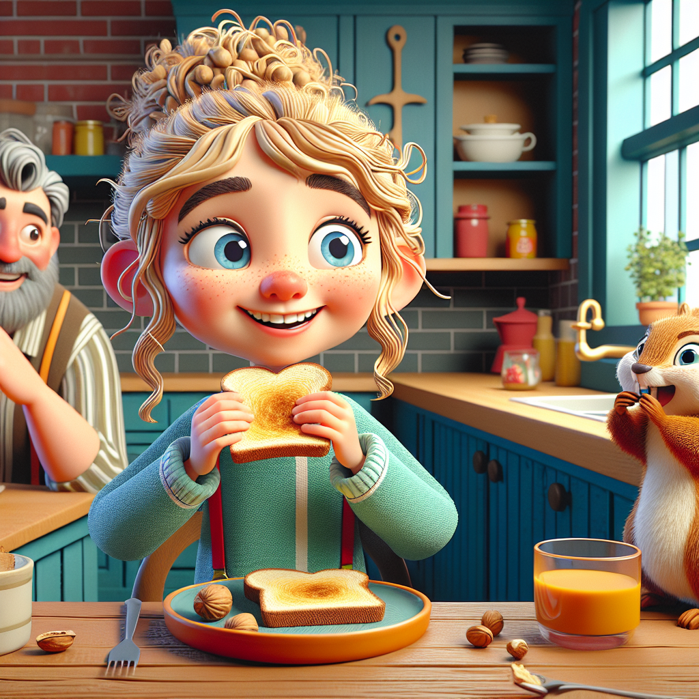
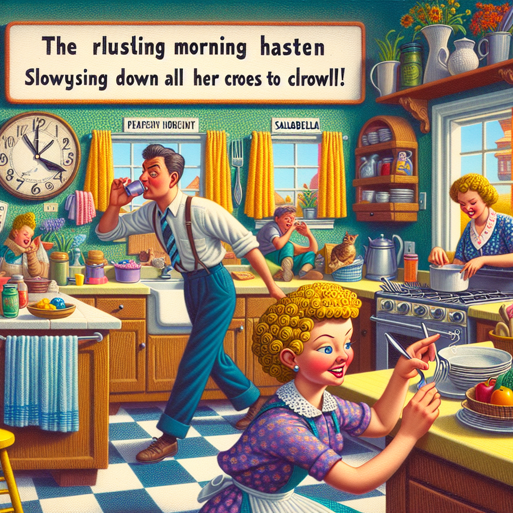
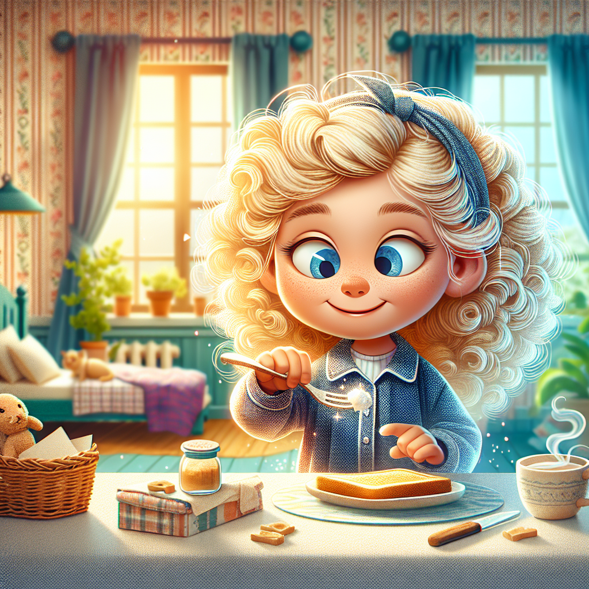
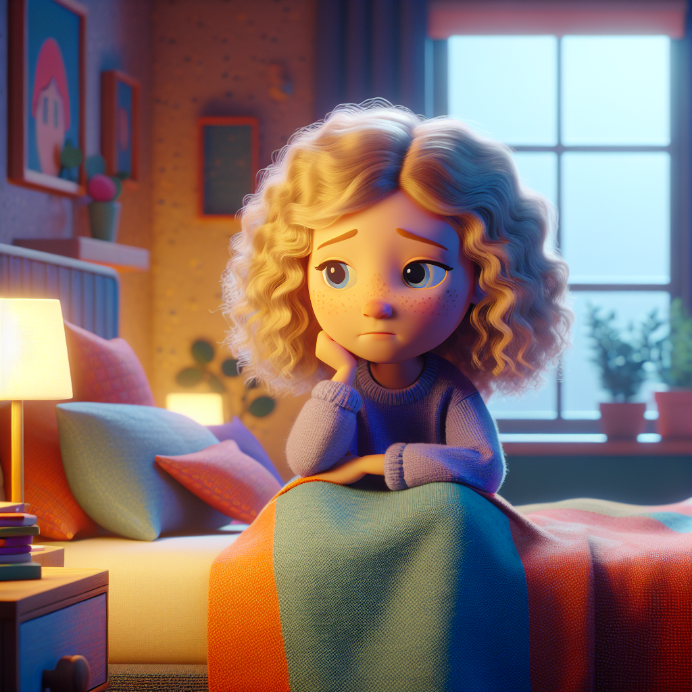
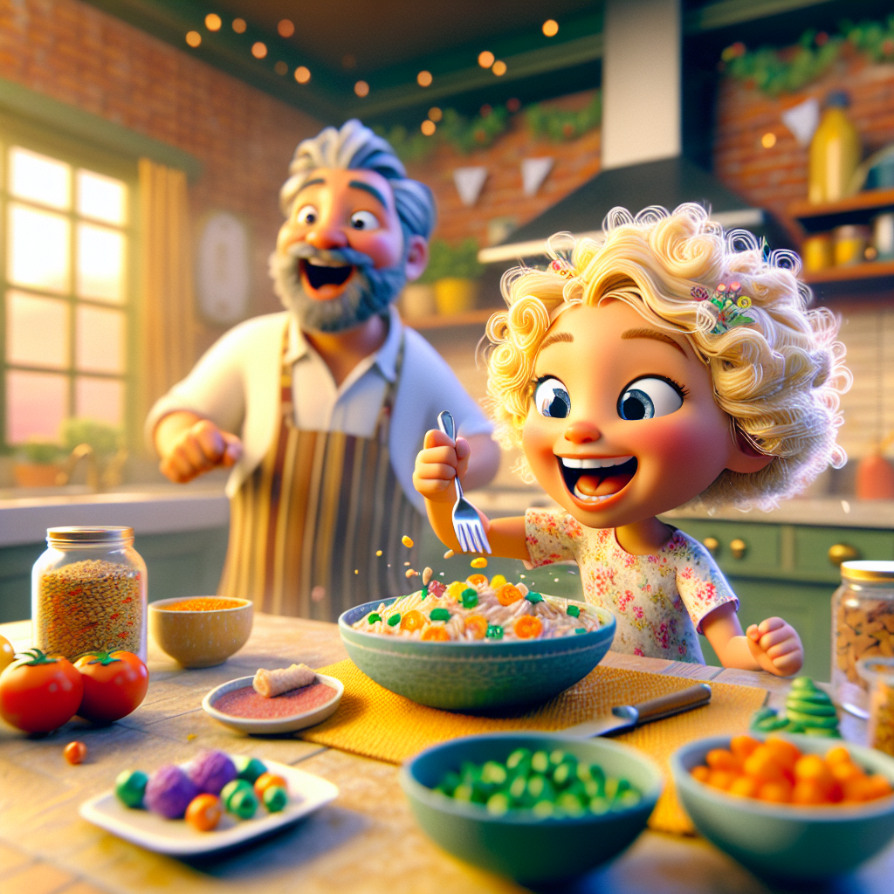

# Stallabella's Story

Once upon a time, in a cozy little town, there lived a 7-year-old girl named Stallabella. She had the most beautiful blond curly hair and sparkling blue eyes. Stallabella was known for her kind heart and her funny jokes, but she had one peculiar habit—she loved to stall.

Every morning, Stallabella's parents would gently wake her up, but she would stretch and yawn, pretending to be a sleepy cat. "Just five more minutes," she would say, turning her morning routine into a slow-motion ballet.

When it was time to get dressed, Stallabella would twirl around her room, trying on different outfits as if she were on a fashion runway. "Which dress should I wear today?" she would ask her reflection, even though she knew she had to wear her school uniform.

Breakfast was another performance. Stallabella would take tiny bites of her toast, pretending she was a squirrel nibbling on nuts. "Mmm, this is delicious," she would say, savoring each bite as if it were a gourmet meal.

Her parents would often urge her to hurry. "Come on, Stallabella, you'll be late for school!" they would say. But Stallabella treated stalling like an art form, turning every task into a dramatic scene.

One sunny morning, Stallabella's teacher, Mrs. Green, announced that there would be a special event at school—a visit from a famous children's author! The author would read from her new book and sign copies for the students. Stallabella was thrilled and couldn't wait to meet her favorite author.

But the next morning, Stallabella's stalling was in full swing. She pretended to be a sleepy cat, twirled around her room, and nibbled on her toast. By the time she was ready to leave, the school bus had already left.

Her parents quickly drove her to school, but when she arrived, the event was over. Stallabella's heart sank as she saw her classmates holding signed books and chatting excitedly about the author's visit. She had missed it all.

That evening, Stallabella sat on her bed, feeling sad. She realized that her stalling had caused her to miss something important. "Maybe stalling isn't always fun," she thought to herself.

The next morning, Stallabella woke up with a new determination. She decided to change her ways and adopt a new name that reflected her newfound attitude—Swiftabella. She got out of bed quickly, dressed in her uniform without any fuss, and ate her breakfast in record time.

Her parents were amazed. "Who is this swift and efficient girl?" they asked with a smile.

"It's me, Swiftabella!" she replied, giggling.

From that day on, Swiftabella found a balance between having fun and being timely. She still enjoyed her little performances, but she made sure they didn't make her late. She discovered that being swift could be just as enjoyable as stalling.

And so, Swiftabella became known not only for her kind heart and funny jokes but also for her ability to get things done on time. She never missed another important event, and she lived happily ever after, dancing through life with grace and swiftness.

**The End.**