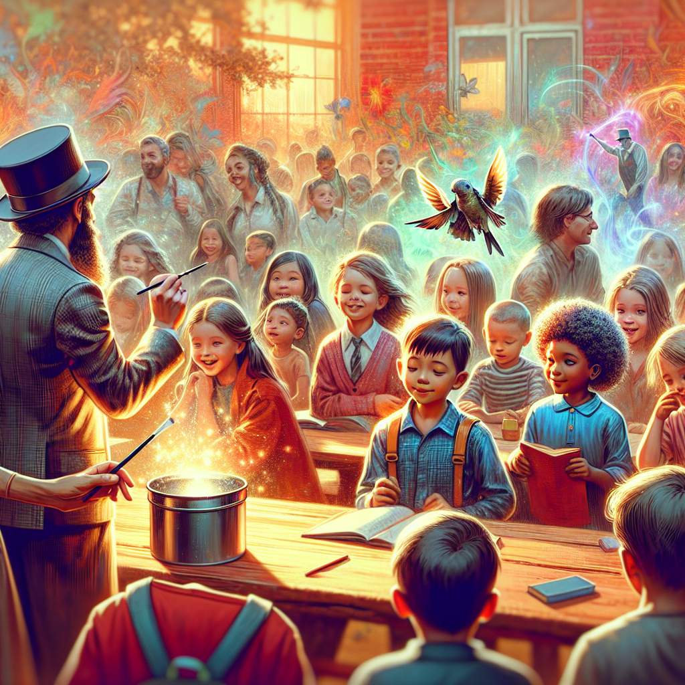
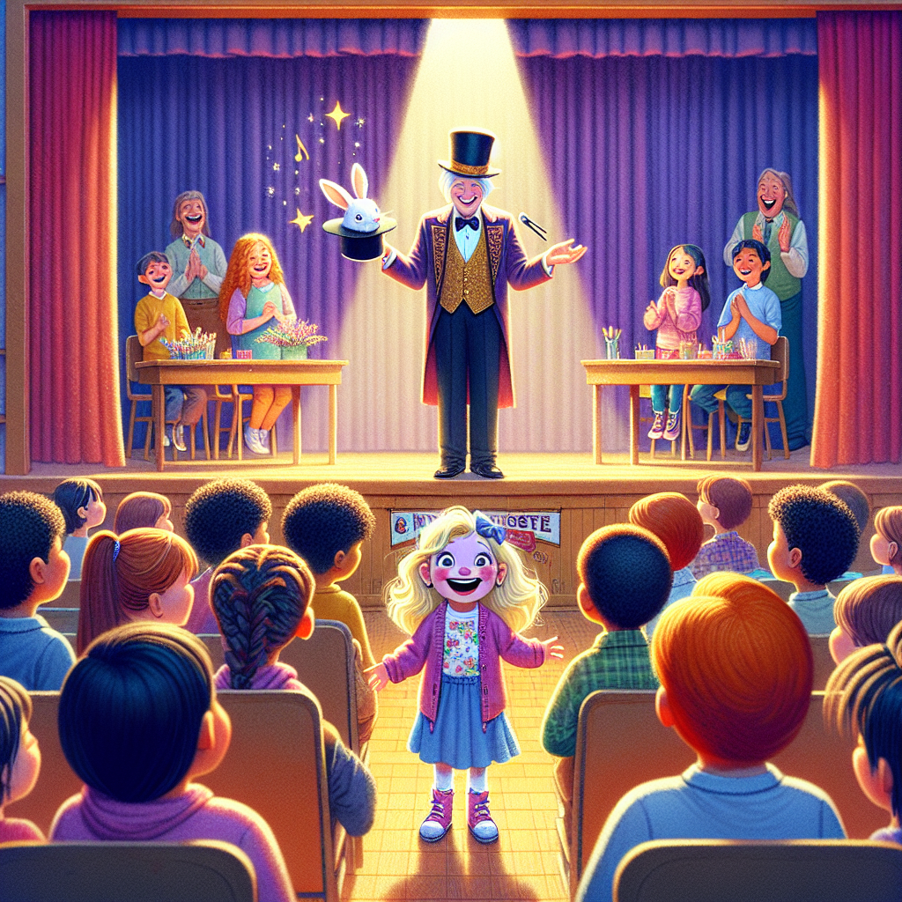
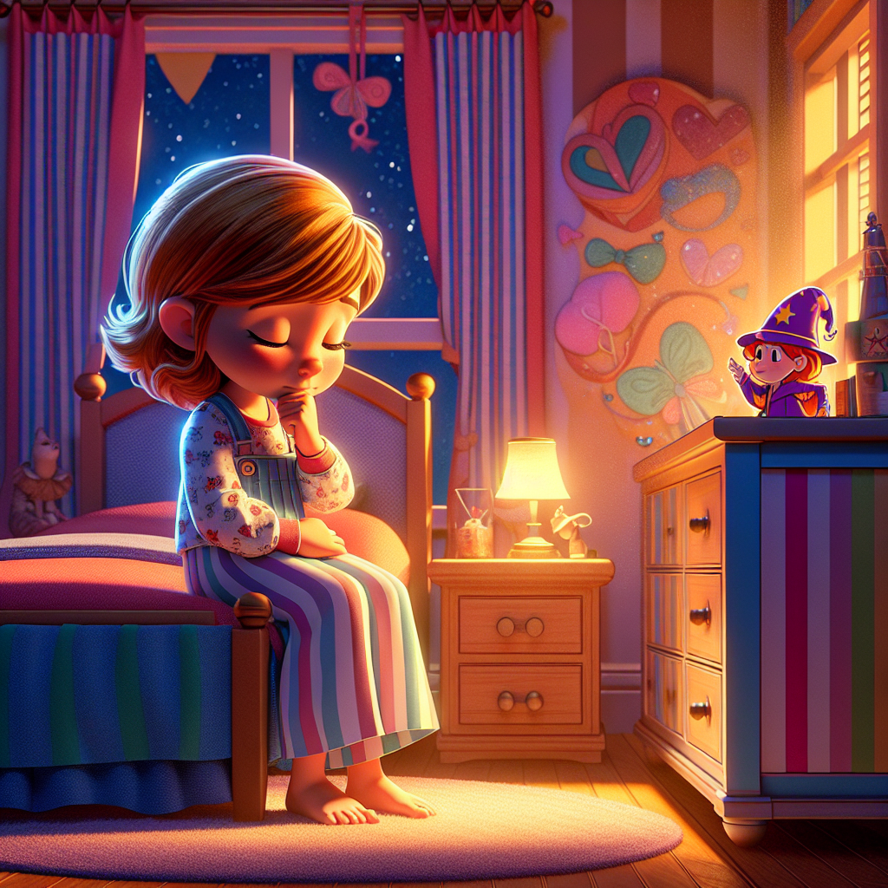
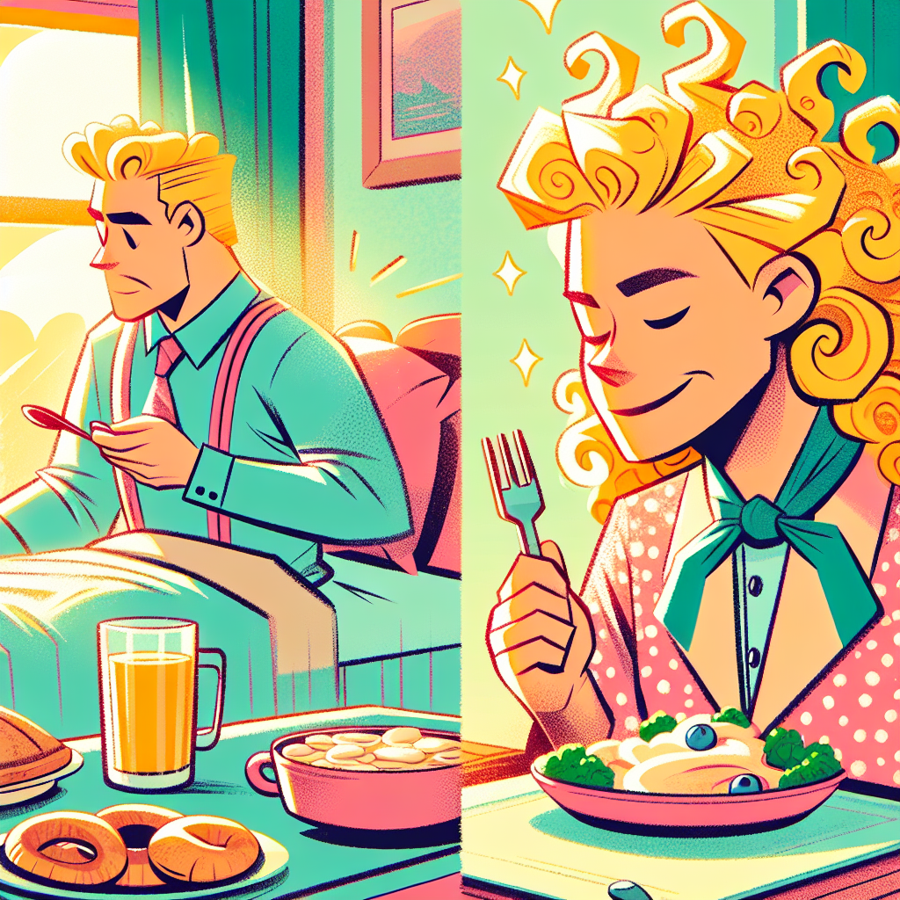
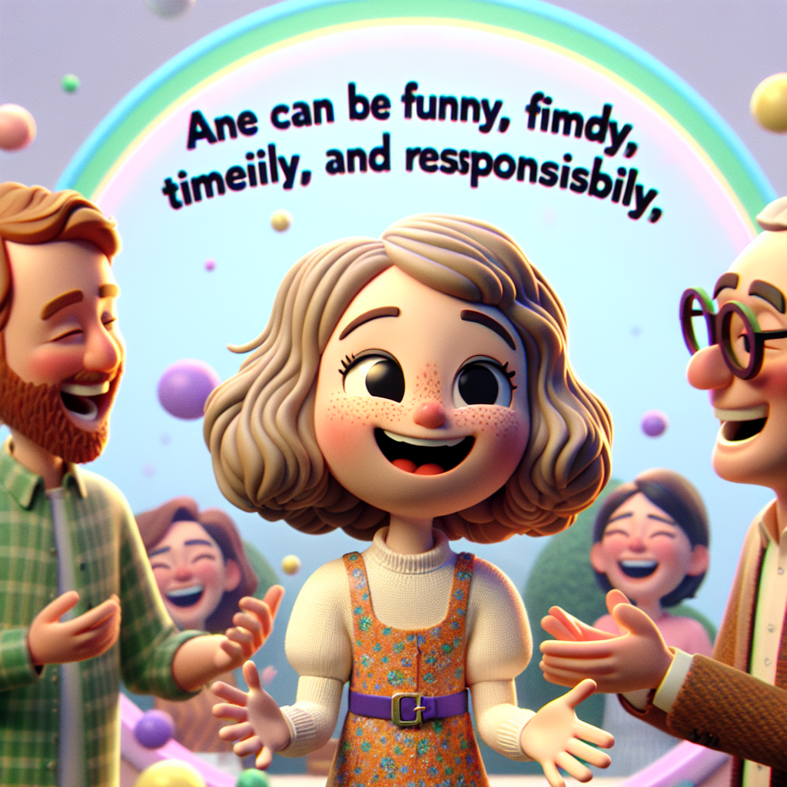
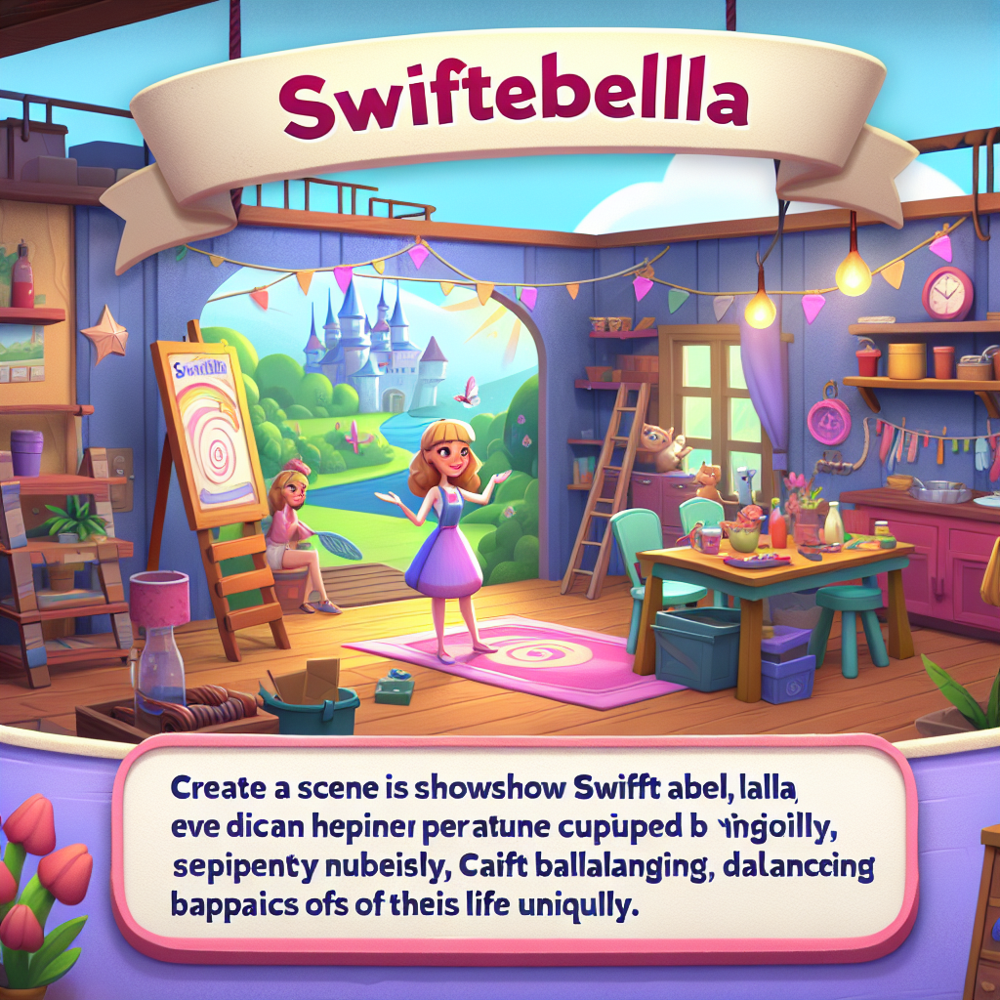

# Stallabella's Story

Once upon a time, in a cozy little town, there lived a 7-year-old girl named Stallabella. She had the most beautiful blond curly hair and sparkling blue eyes that twinkled like stars. Stallabella was known for her kind heart and her funny jokes that could make anyone laugh. But she had one peculiar habit—she loved to stall.

Every morning, Stallabella's parents would gently wake her up, "Time to get up, sweetie!" But Stallabella would stretch and yawn, pretending she was a sleepy cat. She would roll around in bed, making funny faces and telling jokes, delaying her rise as long as she could.

When it was time to get dressed, Stallabella would put on a show. She would twirl around, pretending her clothes were costumes for a grand ballet performance. Her parents would watch, half-amused and half-exasperated, as she danced around her room, taking forever to get ready.

Breakfast was no different. Stallabella would turn her meal into a drama class, making up stories about her cereal and milk. "Oh no, the cereal soldiers are sinking in the milk sea!" she would exclaim, giggling as she slowly ate each bite.

And when it was time to go to school, Stallabella would walk as if she were in a slow-motion movie, waving to imaginary fans and narrating her journey like an epic adventure.

One sunny day, Stallabella's school was hosting a special event—a magic show by the famous magician, Mr. Whizzlebop. All the children were excited and couldn't wait to see the amazing tricks and illusions. Stallabella's parents reminded her, "You need to hurry today, or you'll miss the magic show!"

But Stallabella, true to her nature, turned her morning routine into an elaborate performance. She danced, she joked, and she stalled. By the time she was ready, the magic show had already started.

When Stallabella finally arrived at school, she saw her friends' faces light up with amazement as Mr. Whizzlebop pulled a rabbit out of a hat. But it was too late for her to join in. She felt a pang of disappointment as she realized she had missed the entire show.

That evening, Stallabella sat quietly in her room, thinking about what had happened. She loved her playful stalling, but missing the magic show made her understand that sometimes, being timely was important too.

The next morning, Stallabella woke up with a new determination. She decided to change her ways and even gave herself a new name—Swiftabella. She got out of bed quickly, dressed without any theatrics, and ate her breakfast without turning it into a drama.

Her parents were pleasantly surprised. "Look at you, Swiftabella! You're ready in no time!" they said, smiling proudly.

Swiftabella felt a sense of accomplishment. She realized that she could still be funny and kind-hearted without stalling. She could enjoy her playful nature while also being timely and responsible.

From that day on, Swiftabella found a balance. She still made her friends laugh and brought joy to everyone around her, but she also made sure to be on time for important events. And whenever she felt the urge to stall, she remembered the magic show she had missed and hurried along with a smile.

And so, Swiftabella lived happily, blending her playful spirit with a newfound sense of responsibility, making every day a magical adventure.

	**The End.**ds