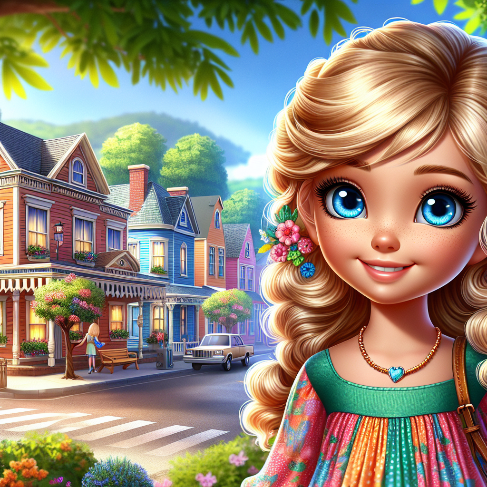
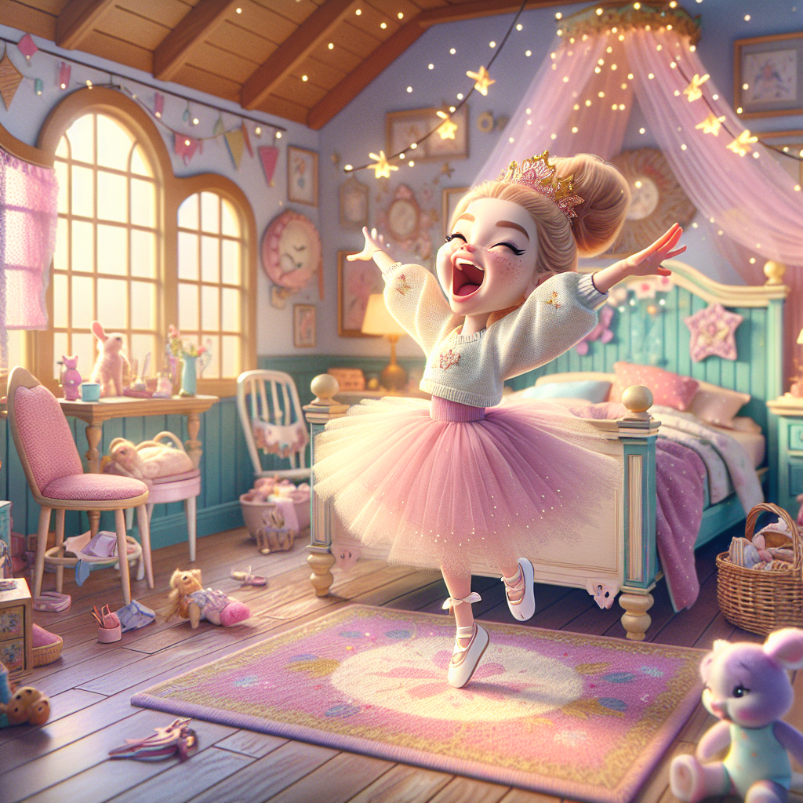
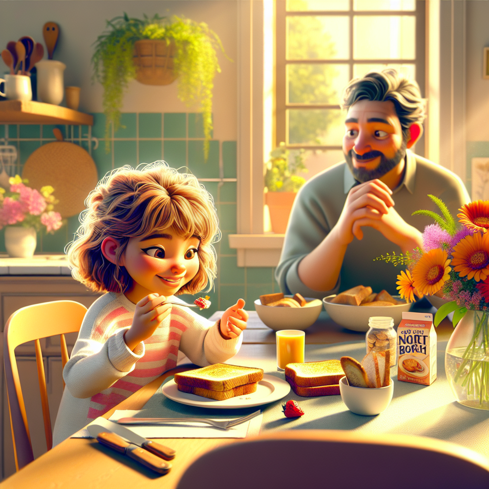
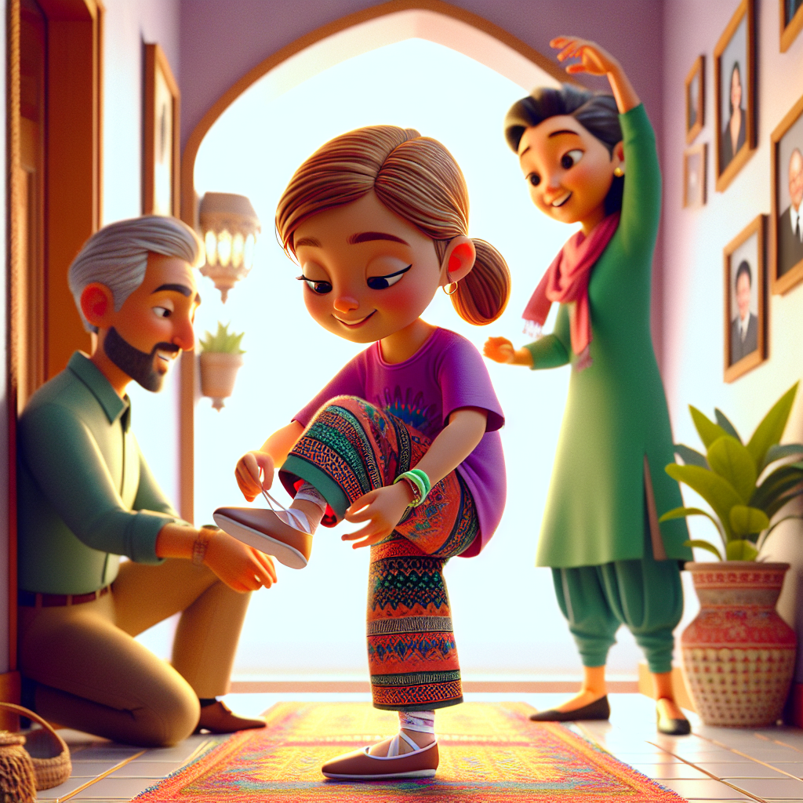
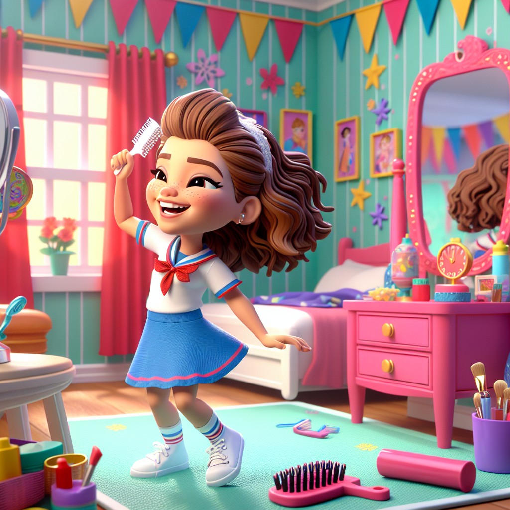
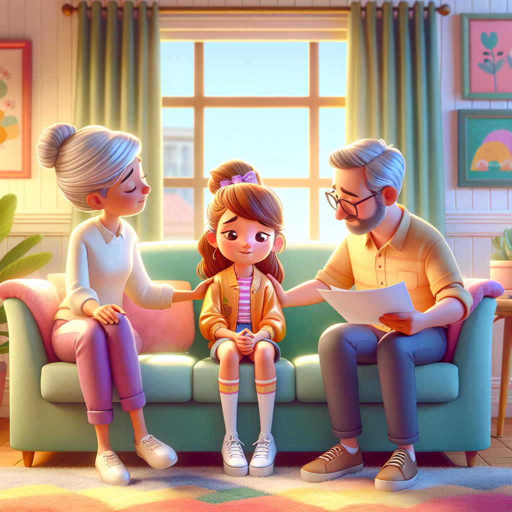
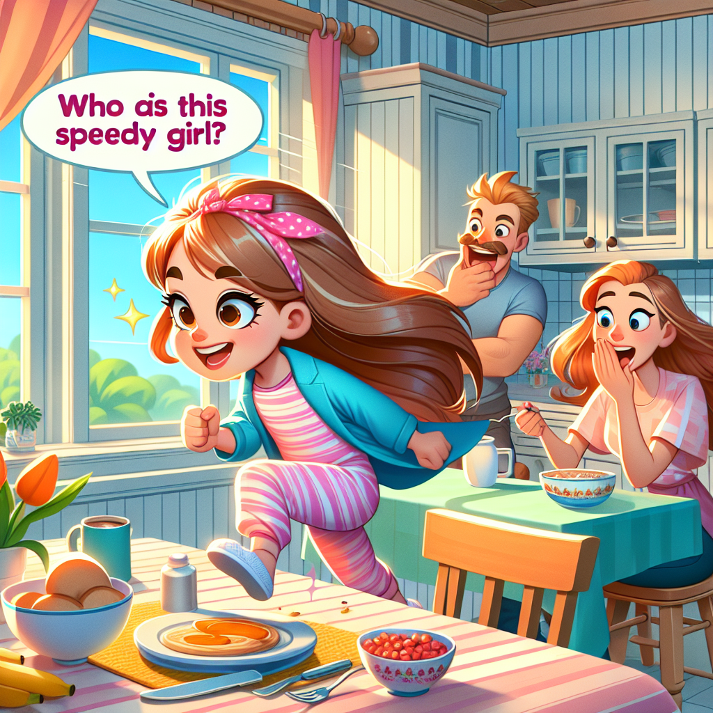
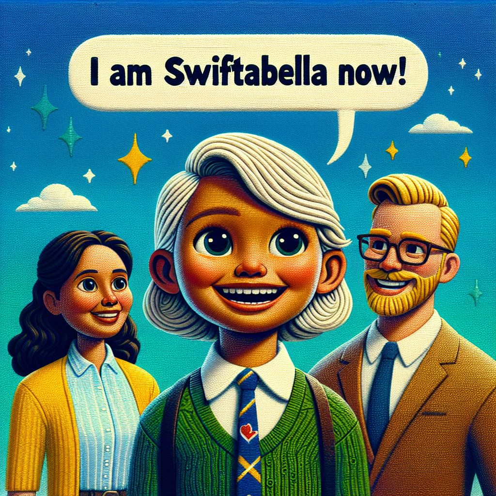
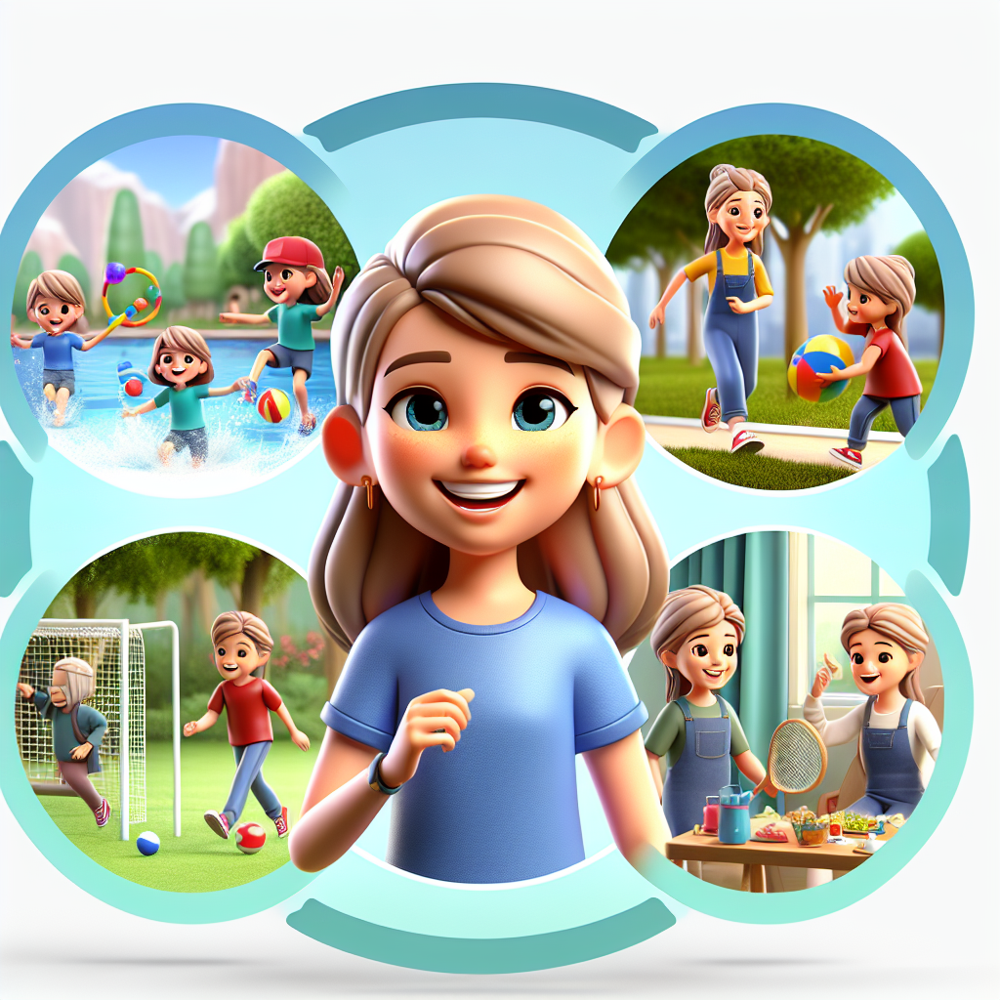

# The Story of Stallabella

Once upon a time, in a cozy little town, there lived a 7-year-old girl named Stallabella. She had the most beautiful blond curly hair and sparkling blue eyes. Stallabella was known for her kind heart and her ability to make everyone laugh. But she had one peculiar habit—she loved to stall.

Every morning, Stallabella's day began with a grand performance. When her alarm clock rang, she would stretch her arms wide, yawn dramatically, and then slowly roll out of bed as if she were a ballerina performing a graceful dance. Her parents would call out, 'Hurry up, Stallabella! It's time to get dressed!' But Stallabella would twirl around her room, pretending to be a princess choosing her royal attire.

At breakfast, Stallabella would take tiny, delicate bites of her toast, as if she were savoring a gourmet meal. Her parents would remind her, 'Eat up, Stallabella! We need to get to school!' But she would smile and say, 'Just one more bite,' turning her meal into a slow-motion feast.

When it was time to leave for school, Stallabella would put on her shoes with the precision of a dancer tying her ballet slippers. Her parents would urge, 'Come on, Stallabella! We're going to be late!' But she would giggle and say, 'I'm almost ready,' as she performed a little jig.

One sunny morning, Stallabella's class was going to have a special event—a visit from a famous children's author. Stallabella was excited, but true to her nature, she took her time getting ready. She danced around her room, twirled in front of the mirror, and even sang a little song while brushing her hair.

By the time she finally arrived at school, the event was over. Stallabella's heart sank as she saw her classmates chatting excitedly about the author's visit. She felt a pang of regret. Her stalling had caused her to miss something important.

That evening, Stallabella sat down with her parents and shared her feelings. 'I missed the author's visit because I took too long to get ready,' she said sadly. Her parents hugged her and said, 'We know you love to make everything fun, but sometimes it's important to be timely.'

Stallabella thought long and hard about what her parents said. She realized that while stalling could be entertaining, it wasn't always practical. She decided it was time for a change. The next morning, she woke up with a new determination. She got out of bed quickly, dressed herself without any theatrics, and ate her breakfast promptly.

Her parents were amazed. 'Who is this speedy girl?' they asked playfully. Stallabella smiled and said, 'I'm Swiftabella now!' From that day on, she became known as Swiftabella, a girl who could still be kind-hearted and funny, but also knew the importance of being timely.

Swiftabella found that she could still have fun without stalling. She discovered new ways to enjoy her day while being prompt and responsible. And whenever she felt the urge to stall, she would remember the day she missed the author's visit and remind herself of her new name and attitude.

And so, Swiftabella lived happily ever after, balancing fun and responsibility, and inspiring others to do the same.

**The End.**

